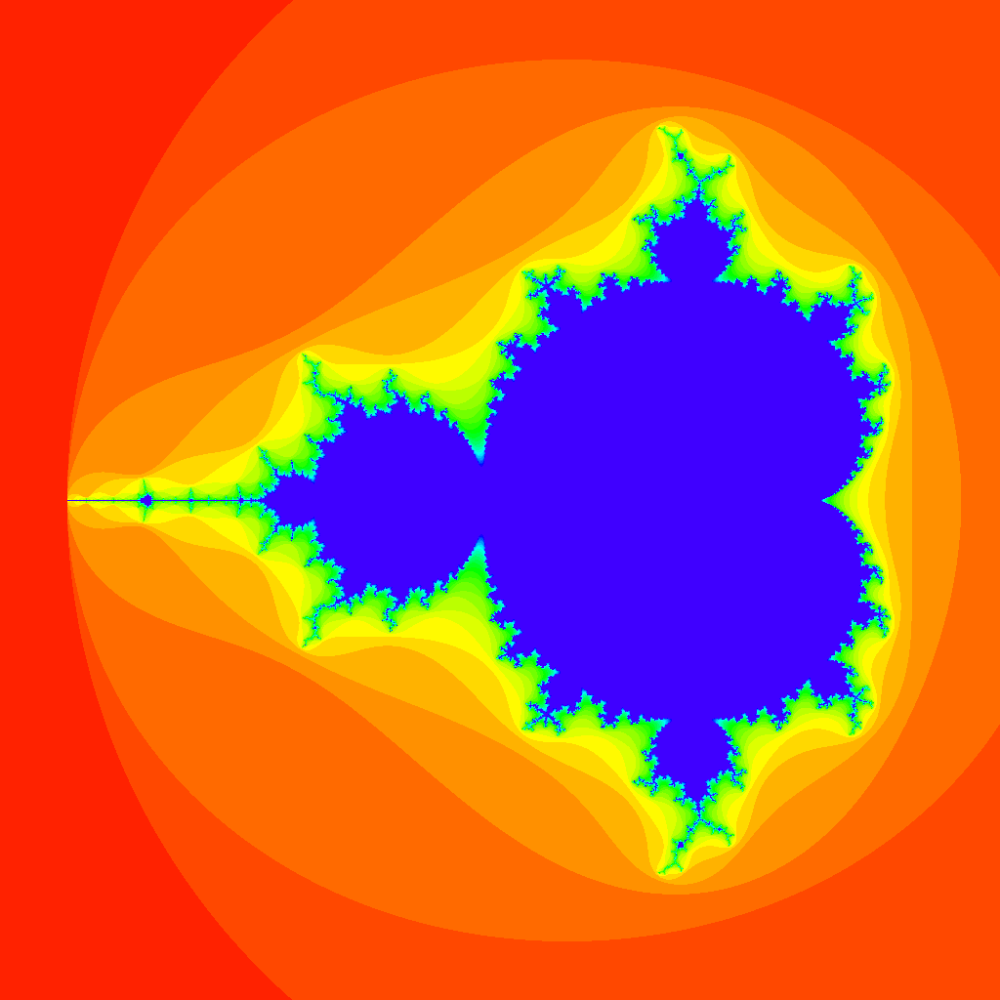

# parallel-processing-mandelbrot.cpp

🤖🤖🤖 C++で並列処理を使用してマンデルブロ集合を描画してみる！  

  

## 実行方法

DevContainerに入り、以下のコマンドを実行します！  

```shell
cmake -H. -B build
cmake --build build
./build/program.out
```

M2 Mac(Docker/Ubuntu)での実行結果は以下の通りです！  

```shell
2023-12-24T11:06:52+00:00
Running ./build/program.out
Run on (4 X 48 MHz CPU s)
Load Average: 0.58, 0.26, 0.20
--------------------------------------------------------
Benchmark              Time             CPU   Iterations
--------------------------------------------------------
BM_ExecSingle  176332250 ns    163801385 ns            4
BM_ExecMulti   113769233 ns     34679924 ns           20
```

かなり早くなっていますね！  
